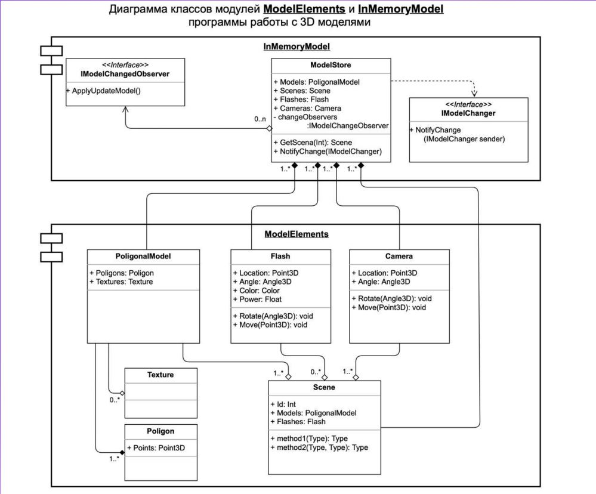

# Урок 1. Введение в понятие архитектуры, проектирование ПО и жизненный цикл программного продукта. UML-диаграммы
## Задание :
На основе Диаграмы классов ModelElements, разработать классы: Model Store, PoligonalModel (Texture, Poligon), Flash, 
Camera, Scene

